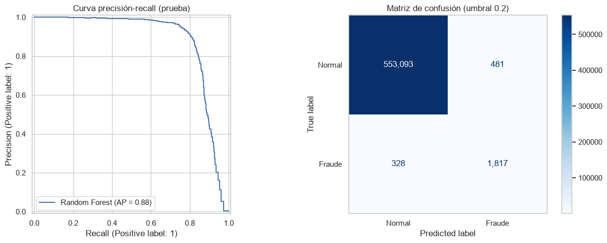
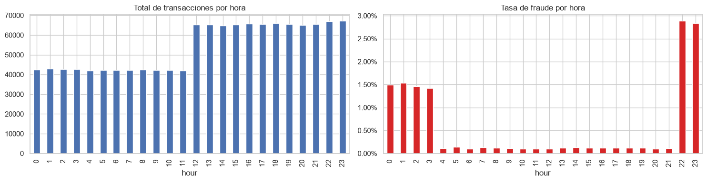

**English** | [Español](README.es.md)

# Credit Card Fraud Detection

Machine Learning project to detect fraudulent credit card transactions. The goal was to reach **PR-AUC, F1 and F2 above 0.75**.

## Results

The best model was **Random Forest** with a decision threshold of 0.2. These are its results on the test set (June to December 2020):

| Metric | Value |
|---|---|
| PR-AUC | 0.88 |
| F1 | 0.82 |
| F2 | 0.84 |
| Recall | 0.85 |
| Precision | 0.79 |

Out of 2,145 frauds, the model detects 1,817. In exchange, it flags 481 normal transactions as suspicious, out of more than 553 thousand.



## Key findings

- Fraud is concentrated between **10:00 PM and 3:59 AM**: in those hours the fraud rate is between 1.4% and 2.9%, while the rest of the day it is 0.1%.
- The median amount of a fraud is 396 dollars, compared to 47 dollars for a normal transaction.
- Online purchases (`shopping_net`, `misc_net`) have the highest fraud rate.
- Customers over 60 have the highest fraud rate.



## Data

[Credit Card Transactions Fraud Detection](https://www.kaggle.com/datasets/kartik2112/fraud-detection) dataset from Kaggle (simulated data):

- `fraudTrain.csv`: 1.3 million transactions (January 2019 to June 2020).
- `fraudTest.csv`: 556 thousand transactions (June to December 2020).

Only 0.58% of the transactions are fraud.

The files are larger than 100 MB, so they are not in the repository. If they are not in `data/raw/`, the code downloads them automatically with `kagglehub`.

## What I did

1. **EDA** on the training data: fraud by hour, day, age, amount and category.
2. **New features:** customer age, hour, day of the week and distance between the customer and the merchant.
3. **Time-based validation:** I used the last 20% of the training data as validation, because fraud data has a time order.
4. **Compared** Dummy, Logistic Regression, Random Forest and XGBoost with PR-AUC, F1 and F2.
5. **Tuned** Random Forest and chose the decision threshold with the validation data.
6. **Evaluated** the final model only once on `fraudTest.csv`.

**Something I fixed:** in the first version the charts by hour counted all transactions instead of frauds, and I concluded that fraud happened from noon to midnight. I also did the EDA with the test data, which is not correct.

## Project structure

```
FraudDetection/
├── data/raw/                 # Kaggle data (not uploaded to GitHub)
├── notebooks/
│   ├── 01_eda.ipynb          # exploratory analysis
│   └── 02_modelado.ipynb     # models, threshold and final evaluation
├── results/figures/          # charts
├── src/
│   ├── data/                 # loading and cleaning
│   ├── features/             # feature engineering
│   ├── preprocessing/        # scaling and one-hot encoding
│   └── modeling/             # metrics and threshold
└── requirements.txt
```

## How to run it

```bash
git clone https://github.com/dixonpa/FraudDetection.git
cd FraudDetection
python -m venv .venv
.venv\Scripts\activate        # on Windows
source .venv/bin/activate     # on Mac/Linux
pip install -r requirements.txt
jupyter notebook notebooks/01_eda.ipynb
```

The first time, the notebook downloads the data from Kaggle (about 200 MB). The modeling notebook trains several models with more than a million rows and can take 10 minutes or more. The notebooks and charts are in Spanish.

## Tools

Python, pandas, scikit-learn, XGBoost, kagglehub, matplotlib, seaborn.

## Author

Paulo Alvarez · [LinkedIn](https://www.linkedin.com/in/paulocealva) · [Portfolio](https://dixonpa.github.io/) · palvarez17@gmail.com
